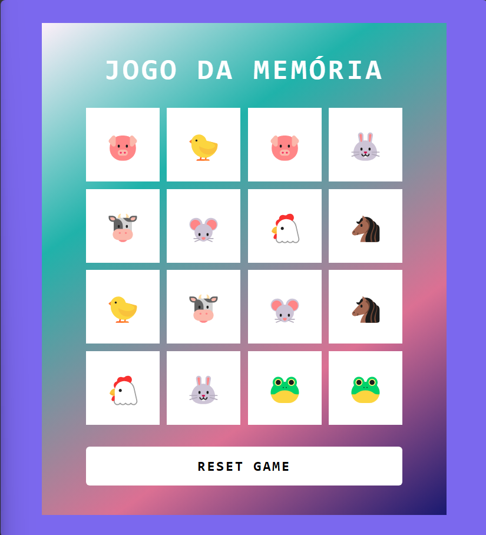

# Jogo da Memória

Bem-vindo ao Jogo da Memória, um projeto desenvolvido com HTML, CSS e JavaScript! Este jogo foi criado no bootcamp Ri Happy - Front-end do Zero pelo prof Felipe Aguiar. 

## 🚀 Tecnologias

- **HTML**: Estrutura básica da interface.
- **CSS**: Estilização do tabuleiro e animações.
- **JavaScript**: Lógica do jogo, controle dos pares e manipulação da DOM.

## 📋 Como Jogar

1. Entre no link `https://nadiacastr0.github.io/jogo-da-memoria/`.
2. Clique sobre os cards para revelá-los.
3. Tente encontrar os pares correspondentes.
4. Ao encontrar todos os pares, uma mensagem de vitória será exibida!
5. Use o botão **RESET GAME** para reiniciar o jogo e tentar novamente.

## 🛠 Como Executar Localmente

1. Clone este repositório:
   ```bash
   git clone https://github.com/nadiacastr0/jogo-da-memoria.git

## 🎮 Divirta-se e aproveite o jogo!
